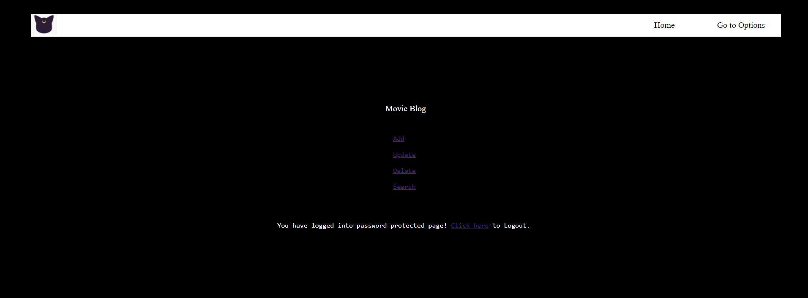
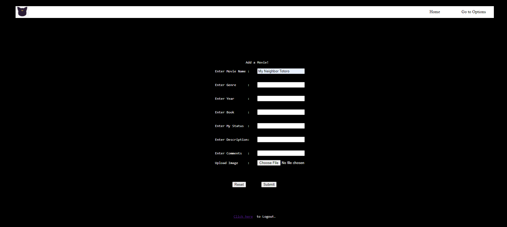
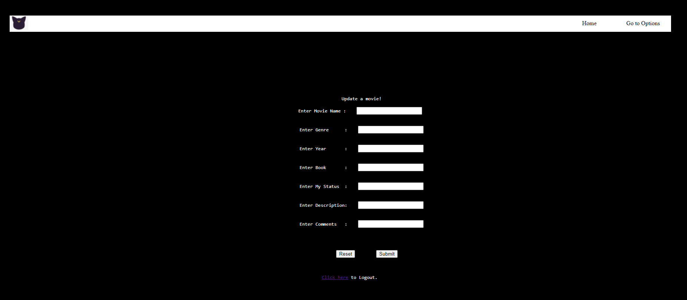
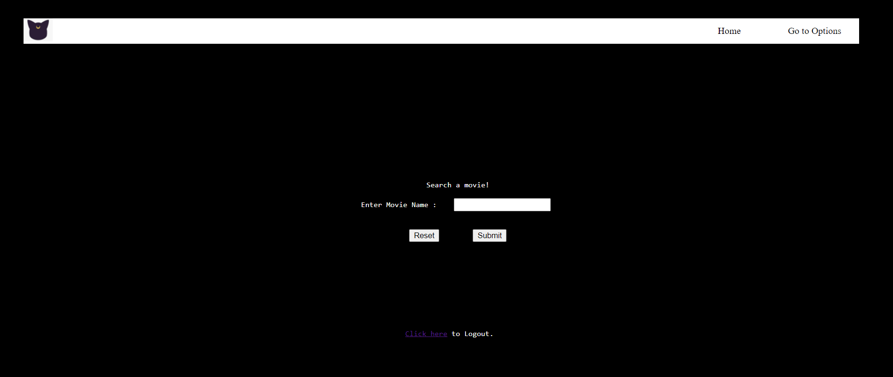
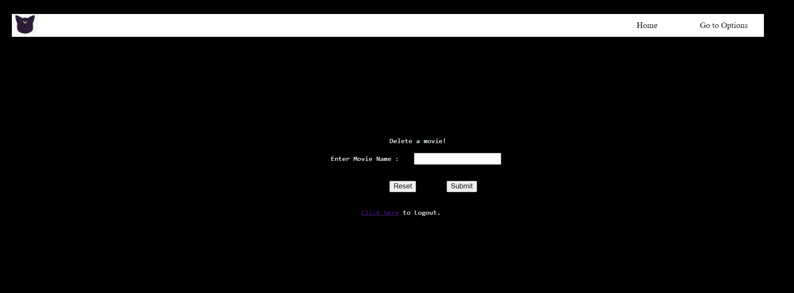

## **CSC-4370 - Web Programming** 

### PROJECT PROPOSAL

+ **Project:** Personal movie/TV series blog site

+ **Problem :** I love watching movies. My favorite genres are anime, sci-fi, thriller, horror, and documentary. Sometimes I start watching 10 to 12 movies or series at the same time. Some of them are completed, some films have prequels & sequels, some tv-series are ongoing. So, I often forget which one I just watched. I also love to read discussions about the movies that are true stories based or the ones that catch my attention. Some movies are the live actions of novels/short stories/comics. I have a few collections of those books but not all that I’ve watched so far. Currently, I don’t use any notes or have any software/app to track all of this scattered information.

+ **Proposed Solution :** I want to create a site that will allow me to track the status of the shows (such as – ongoing, watching, watchlist), type of the shows (such as - series, movie, short film), categories of them (such as – thriller, sci-fi, anime, fantasy). This site will also have the space to add my comments, link to the comments that I’ve found interesting, youTube links to trailers. This site will also contain the information of the shows, such as – if they are based on novels/short stories and if I possess them or not. A navigation menu and a database will be helpful to store all of this information. In the future, I would like to make it not only a personal movie analyzer blog but also a blog for bookworms.

+ **Technology :** Language - HTML, CSS, PHP, SQL. Tools - MariaDB, Notepad++, FileZilla and University server (codd) to publish the pages.

+ **Page Design and Requirements** 
+ Home : This page is only for the viewers. Viewers can only see what post has been updated on the page and read about it. All the information including the images are stored and fetched from the database using PHP.

+ Login Page : This page is only for the admin to log in so that the admin can make changes to the blog post. This page is created by PHP array; login information aren't stored in the database. 

+ Admin Main Page : After successfully login, admin can now select option to add, update, delete and search for a movie.

+ Add Page : Admin can add the specific information in this page. The information gets stored in the database and are also being fetched in Home page to be displayed. If any field are kept blank, it won't be shown on the home page. 

+ Update Page : Admin can update anything by the existing movie name except the image. Fields that will be kept blank, will be erased from the database.

+ Search Page : Search any movie by its name. It will redirect to you a simple page with few details of the movie. That means the movie is in the database. Details page has the link to return the Home page.

+ Delete Page : Admin can delete all information about a movie only by its name.

+ Logout Page : Admin can logout from the admin view and this page will redirect to the login page. 
