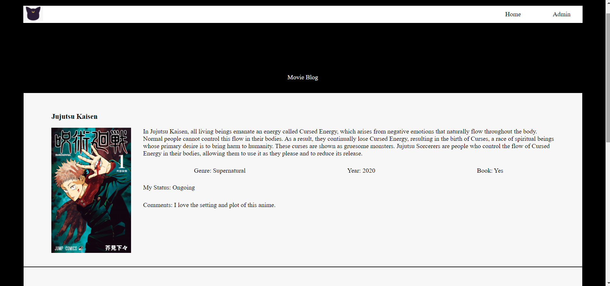
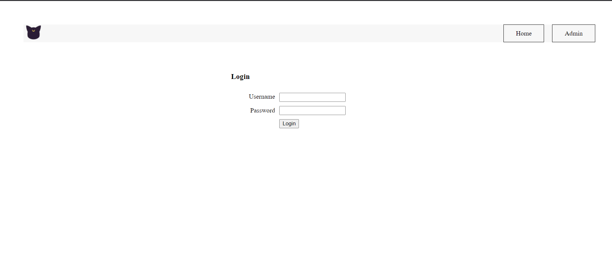

## **CSC-4370 - Web Programming** 

### PROJECT PROPOSAL

+ **Project:** Personal movie/TV series blog site

+ **Problem :** I love watching movies. My favorite genres are anime, sci-fi, thriller, horror, and documentary. Sometimes I start watching 10 to 12 movies or series at the same time. Some of them are completed, some films have prequels & sequels, some tv-series are ongoing. So, I often forget which one I just watched. I also love to read discussions about the movies that are true stories based or the ones that catch my attention. Some movies are the live actions of novels/short stories/comics. I have a few collections of those books but not all that I’ve watched so far. Currently, I don’t use any notes or have any software/app to track all of this scattered information.

+ **Proposed Solution :** I want to create a site that will allow me to track the status of the shows (such as – ongoing, watching, watchlist), type of the shows (such as - series, movie, short film), categories of them (such as – thriller, sci-fi, anime, fantasy). This site will also have the space to add my comments, link to the comments that I’ve found interesting, youTube links to trailers. This site will also contain the information of the shows, such as – if they are based on novels/short stories and if I possess them or not. A navigation menu and a database will be helpful to store all of this information. In the future, I would like to make it not only a personal movie analyzer blog but also a blog for bookworms.

+ **Technology :** A navigation menu and a database will be helpful to store all of this information. I’ve not chosen which type of database I’ll choose. I’ll use HTML and CSS files for the website. For the frontend, I’ll choose a standard web framework as I learn more about them in my upcoming lecture.

+ **Page Design** 
+ Home
+ 

+ Admin

